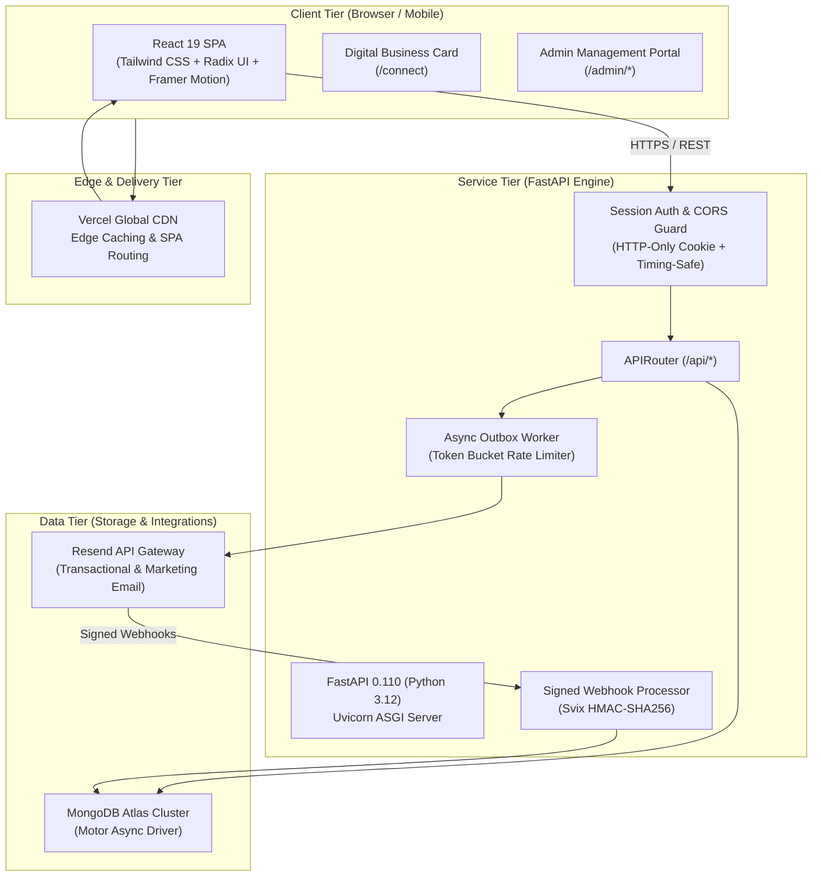
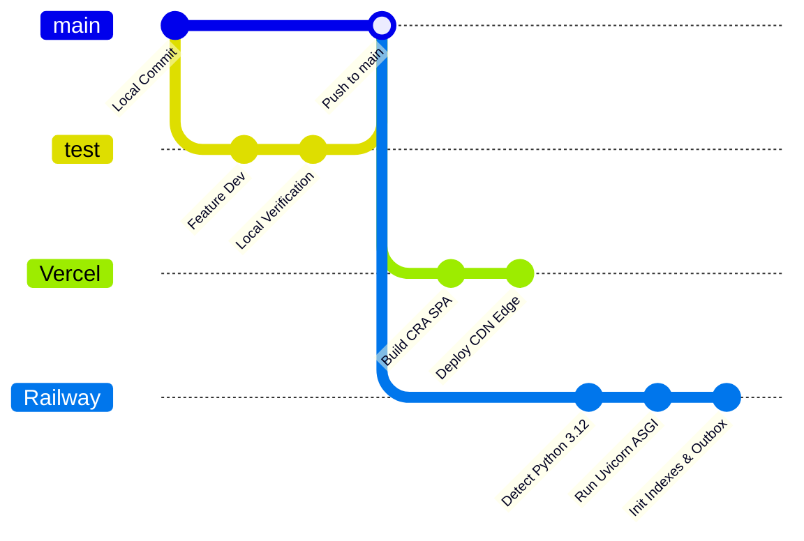

# P Suman & Associates — Application Platform Overview

> Comprehensive Technical & Executive Overview of the Digital Ecosystem for **P Suman & Associates** (Chartered Accountancy · Internal Audit · Inventory Intelligence · Risk & Tax Advisory).

---

## Table of Contents

1. [Executive & Non-Technical Perspective](#1-executive--non-technical-perspective)
   - [1.1 Purpose & Vision](#11-purpose--vision)
   - [1.2 Target Audience & Market Positioning](#12-target-audience--market-positioning)
   - [1.3 Brand Identity & Visual Aesthetic](#13-brand-identity--visual-aesthetic)
   - [1.4 Key Capabilities & User Journeys](#14-key-capabilities--user-journeys)
   - [1.5 The Partner & Client Ecosystem](#15-the-partner--client-ecosystem)
   - [1.6 Business Impact & Governance](#16-business-impact--governance)
2. [Technical Architecture Perspective](#2-technical-architecture-perspective)
   - [2.1 Architectural Paradigm & System Topology](#21-architectural-paradigm--system-topology)
   - [2.2 Technology Stack Matrix](#22-technology-stack-matrix)
   - [2.3 Frontend Engineering (React 19 SPA)](#23-frontend-engineering-react-19-spa)
   - [2.4 Backend Engineering (FastAPI Asynchronous Microservice)](#24-backend-engineering-fastapi-asynchronous-microservice)
   - [2.5 Database & Data Tier (MongoDB Atlas)](#25-database--data-tier-mongodb-atlas)
   - [2.6 Core Subsystems Deep Dive](#26-core-subsystems-deep-dive)
     - [A. Lead & Inquiry Pipeline Engine](#a-lead--inquiry-pipeline-engine)
     - [B. Insights Content Management System (CMS)](#b-insights-content-management-system-cms)
     - [C. Enterprise Communications & Outbox Engine](#c-enterprise-communications--outbox-engine)
     - [D. Webhook Event Ingestion & Deliverability Safeguards](#d-webhook-event-ingestion--deliverability-safeguards)
   - [2.7 Security, Authentication & Session Model](#27-security-authentication--session-model)
   - [2.8 Infrastructure, Deployment & CI/CD Pipeline](#28-infrastructure-deployment--cicd-pipeline)
3. [Developer & Operational Runbook](#3-developer--operational-runbook)
   - [3.1 Environment Configuration](#31-environment-configuration)
   - [3.2 Local Development Setup](#32-local-development-setup)
   - [3.3 Key Operational Workflows](#33-key-operational-workflows)

---

# 1. Executive & Non-Technical Perspective

```
┌───────────────────────────────────────────────────────────────────────────┐
│                       P SUMAN & ASSOCIATES                                │
│           Chartered Accountancy · Audit · Risk · Tax Advisory             │
└─────────────────────────────────────┬─────────────────────────────────────┘
                                      │
        ┌─────────────────────────────┼─────────────────────────────┐
        ▼                             ▼                             ▼
┌──────────────┐              ┌──────────────┐              ┌──────────────┐
│ Corporate    │              │ Leadership & │              │ Operational  │
│ Marketing    │              │ Networking   │              │ Back-Office  │
│ Experience   │              │ (/connect)   │              │ (/admin)     │
└──────────────┘              └──────────────┘              └──────────────┘
```

### 1.1 Purpose & Vision

**P Suman & Associates (PSA)** is a premier Chartered Accountancy, Audit, and Advisory practice operating at the intersection of traditional professional diligence and modern data-enabled financial governance.

The platform at `psumanassociates.com` is designed to:
- Establish an **unmistakable corporate authority** comparable to Big-Four and top-tier global strategy firms (McKinsey, KPMG, PwC).
- Provide prospective enterprise clients with clear, articulate access to the firm's core practice areas: Internal Audit, Inventory Intelligence, Risk Advisory, Corporate Tax, and Transaction Advisory.
- Eliminate friction in client onboarding, consultations, partner networking, and regulatory knowledge dissemination through digital workflows.

### 1.2 Target Audience & Market Positioning

The platform speaks directly to high-stakes corporate decision makers:
- **Chief Financial Officers (CFOs) & Financial Controllers**: Seeking rigorous audit methodologies, risk containment, internal financial controls (IFC), and tax optimization.
- **Board Audit Committees & Promoters**: Requiring independent verification, corporate governance frameworks, and forensic oversight.
- **Supply Chain & Operations Directors**: Demanding real-time inventory validation, warehouse reconciliation, and physical inventory tracking ("Inventory Intelligence").
- **Private Equity & Family Offices**: Evaluating portfolio compliance, acquisition due diligence, and enterprise risk.

### 1.3 Brand Identity & Visual Aesthetic

The user interface rejects generic accounting clichés (stock calculators, handshake photos, standard blues). Instead, it embodies **"quiet luxury" and executive gravitas**:
- **Palette**: Architectural Ivory (`bg-ivory`), deep obsidian ink (`text-ink`), muted institutional navy, and refined champagne gold accents.
- **Typography & Motion**: Clean editorial font scales, thoughtful whitespace, and fluid scroll-triggered micro-animations powered by Framer Motion.
- **Tone**: Measured, authoritative, concise, and focused on risk-adjusted enterprise value.

---

### 1.4 Key Capabilities & User Journeys

#### 1. Public Marketing & Services Showcase
- **Practice Areas (`/services`)**: In-depth overviews of Internal Audit, Physical Stock & Inventory Intelligence, Risk Advisory, Indirect & Direct Taxation, and Forensic Due Diligence.
- **Industry Solutions (`/industries`)**: Sector-specific case applications tailored to Manufacturing, FMCG & Retail, Logistics & Supply Chain, Healthcare & Pharmaceuticals, and High-Growth Tech.
- **Firm Profile (`/about`)**: Partner credentials, firm philosophy, methodology, and commitment to independence and compliance.
- **Thought Leadership Hub (`/insights`)**: Regulatory alerts, budget analyses, tax advisory bulletins, and strategic articles with estimated reading times, categorization, and author profiles.

#### 2. Digital Networking & Business Card (`/connect`)
- Dedicated, distraction-free partner card interface designed for high-impact networking (NFC taps, conference QR codes).
- Instant **vCard download** (`.vcf`), tap-to-call, tap-to-email, direct WhatsApp inquiry, and office navigation links.
- Independent route that hides standard header/footer navigation to maintain an app-like mobile card experience.

#### 3. Client Inquiry & Lead Capture (`/contact`)
- Structured intake form capturing client name, enterprise name, corporate designation, contact coordinates, selected service domain, and message details.
- Immediate automated client acknowledgment via transactional email with firm turnaround SLAs.
- Simultaneous real-time dispatch to the internal lead pipeline for partner assignment.

#### 4. Newsletter & Regulatory Intelligence Subscription
- One-click subscription block embedded across key editorial touchpoints.
- Automated welcome briefing sent upon signup with corporate credentials and firm overview.
- Full privacy compliance with transparent, single-click instant unsubscription links (`/api/unsubscribe`).

---

### 1.5 The Partner & Client Ecosystem

In addition to the public-facing portal, the platform features a secure **Admin Management Suite** (`/admin`) that transforms the website from a static brochure into an active operational engine:

```
┌────────────────────────────────────────────────────────────────────────┐
│                        ADMIN MANAGEMENT SUITE                          │
├───────────────────┬───────────────────┬────────────────────────────────┤
│ 1. Inquiry CRM    │ 2. Insights CMS   │ 3. Communication Studio        │
│ • Lead Stages     │ • Article Studio  │ • Campaign Composer            │
│ • Partner Notes   │ • Markdown & HTML │ • Audience Segmentation        │
│ • Excel/CSV Export│ • Draft / Publish │ • 2-Step Safety Dispatch       │
└───────────────────┴───────────────────┴────────────────────────────────┘
```

1. **Inquiry Management Pipeline (`/admin/inquiries`)**:
   - Manages prospective client inquiries across defined lifecycle stages: `new` → `contacted` → `qualified` → `converted` → `closed`.
   - Partner notes and status history tracking.
   - Comprehensive multi-parameter search, date filtering, and one-click export to formatted **Excel (`.xlsx`)** and **CSV** for partner meetings.

2. **Insights Content Management System (`/admin/insights`)**:
   - In-house publishing studio for firm partners to write, edit, schedule, and publish thought leadership pieces.
   - Markdown/HTML authoring, automatic slug generation, SEO metadata, reading time estimation, and category management.

3. **Enterprise Communications & Campaign Center (`/admin/communication`)**:
   - High-touch communication studio for firm-wide broadcasts (e.g., annual regulatory updates, Independence Day addresses, tax season advisories).
   - Live HTML template editor with real-time responsive iframe preview.
   - Audience builder with instant deduplication and suppression filtering.
   - Multi-tier safety gates requiring explicit recipient-count confirmation before broadcast.

### 1.6 Business Impact & Governance

- **Zero-Accidental-Email Guarantee**: Built-in development/staging allowlists ensure no test dispatch ever touches a client inbox during maintenance or testing.
- **Anti-Spam & Deliverability Compliance**: Complete suppression tracking (bounces, complaints, manual opt-outs) cryptographically synchronized with email gateways.
- **Enterprise Audit Trail**: Every communication, delivery attempt, bounce, inquiry status change, and session login is permanently recorded with timestamps and operator telemetry.

---

# 2. Technical Architecture Perspective



---

### 2.1 Architectural Paradigm & System Topology

The platform implements a **Decoupled Asynchronous Microservice Architecture**:
- **Stateless Client Layer**: A single-page application (SPA) distributed globally across Vercel’s edge network, ensuring sub-100ms first contentful paint (FCP) anywhere in the world.
- **Asynchronous Service Layer**: A Python 3.12 FastAPI microservice handling RESTful traffic, background processing, rate limiting, and cryptographic validation.
- **Document Store Tier**: MongoDB Atlas housing unstructured marketing content, inquiry records, outbox jobs, and transactional audit trails.
- **Reliable Outbox Pattern**: Asynchronous job queue decoupling user-facing requests from external third-party API dependencies (Resend), eliminating network bottlenecks during user form submission.

---

### 2.2 Technology Stack Matrix

| Layer | Technology | Version | Key Responsibility |
| :--- | :--- | :--- | :--- |
| **Frontend Core** | React | 19.x | Declarative component UI engine |
| **Routing** | React Router | v7 (`BrowserRouter`) | Client-side routing with route guards |
| **Styling** | Tailwind CSS | 3.4.x | Design system tokens, responsive utilities |
| **Build Tooling** | Create React App + CRACO | `@craco/craco` 7.x | Path aliasing (`@/*`) and build optimizations |
| **Motion** | Framer Motion | 11.x | Scroll animations, page transitions, interactive cards |
| **UI Primitives** | Radix UI | Latest | Accessible dialogs, dropdowns, tooltips |
| **Icons & Feedback** | Lucide React + Sonner | Latest | UI iconography and stacked toast notifications |
| **Backend Core** | FastAPI + Starlette | 0.110.x / Python 3.12 | Async REST API framework |
| **ASGI Server** | Uvicorn | Standard | High-performance asynchronous HTTP server |
| **Database Driver** | Motor (PyMongo) | 3.3.x (async) | Non-blocking MongoDB client |
| **Validation** | Pydantic | 2.13.x | Type safety, serialization, schema validation |
| **Email Gateway** | Resend Python SDK | >= 2.30.0 | Transactional & bulk delivery |
| **Signature Verify** | Svix | >= 1.20.0 | Cryptographic webhook signature validation |
| **Spreadsheets** | openpyxl | Latest | Styled Excel generation for lead pipeline exports |
| **Hosting (Web)** | Vercel | Production Edge | Static site hosting, SSL, edge rewrites |
| **Hosting (API)** | Railway / Render | Containerized | Cloud container deployment with zero downtime |
| **Database Host** | MongoDB Atlas | M0 / Dedicated | Multi-region cloud document database |

---

### 2.3 Frontend Engineering (React 19 SPA)

The frontend application located in `frontend/` is structured around component modularity, strict separation of concerns, and reusable atomic primitives.

#### Directory Structure
```
frontend/src/
├── components/
│   ├── admin/             # Admin portal components (AuthGuard, CampaignReview, TemplateStudio)
│   ├── Header.jsx         # Global desktop & mobile navigation
│   ├── Footer.jsx         # Global footer with practice links and disclaimers
│   ├── NewsletterBlock.jsx# Embedded subscription capture form
│   └── ScrollToTop.jsx    # Automatic viewport reset on route changes
├── pages/
│   ├── Home.jsx           # Corporate landing hero, credibility stats, value propositions
│   ├── Services.jsx       # Interactive tabbed service catalog
│   ├── Industries.jsx     # Industry-specific advisory capabilities
│   ├── About.jsx          # Firm leadership, philosophy, credentials
│   ├── Insights.jsx       # Filterable thought leadership directory
│   ├── InsightDetail.jsx  # Rich article reading view with social share & lead CTA
│   ├── Contact.jsx        # Consultation booking form with instant validation
│   ├── Connect.jsx        # Standalone digital networking card (vCard / QR)
│   ├── AdminLogin.jsx     # Secure authentication portal
│   ├── AdminDashboard.jsx # Executive cockpit & platform metrics
│   ├── AdminInquiries.jsx # CRM pipeline board with Excel/CSV export
│   ├── AdminInsights.jsx  # Thought leadership CMS studio
│   └── AdminCommunication.jsx # Bulk outbox composer & delivery monitor
├── hooks/                 # Custom reusable hooks (e.g. useAdminAuth, useDebounce)
├── lib/                   # Shared utility modules (Axios client, cn class merge)
└── constants/             # Navigation links, contact coordinates, brand tokens
```

#### Key Design System Tokens (`tailwind.config.js` / `index.css`)
- `bg-ivory`: `#FBFBF9` — Warm, editorial paper-inspired backdrop.
- `text-ink`: `#0F172A` — High-contrast deep slate for executive typography.
- `accent-gold`: `#D4AF37` / `#C5A059` — Subtle metallic highlight for borders and badges.
- `navy-corporate`: `#0B192C` — Deep navy for hero surfaces and corporate contrast.

---

### 2.4 Backend Engineering (FastAPI Asynchronous Microservice)

The backend in `backend/` is designed for high concurrency, zero-blocking I/O, and defense-in-depth API protection.

```
backend/
├── core/
│   ├── config.py          # Typed Pydantic settings loading from environment
│   └── auth.py            # JWT token creation, cookie verification, password hashing
├── models/
│   └── email.py           # Schemas for outbox jobs, campaigns, templates, logs
├── routes/
│   ├── admin_auth.py      # Login, session verification, logout
│   ├── admin_inquiries.py # Lead management, notes, status workflow, Excel export
│   ├── admin_insights.py  # Article CRUD, slug generation, publication toggles
│   ├── admin_campaigns.py # Broadcast drafts, audience calculation, 2-step dispatch
│   ├── admin_templates.py # Template Studio versioning and previewing
│   ├── admin_logs.py      # Real-time outbox delivery logs and stats
│   ├── webhooks.py        # Signed Resend webhook receiver (bounces, deliveries)
│   └── unsubscribe.py     # Public one-click unsubscription endpoint
├── services/
│   └── email/
│       ├── worker.py      # Background outbox worker with token-bucket limiter
│       ├── provider.py    # Resend API interface with mock simulation fallback
│       ├── renderer.py    # Responsive HTML template compiler & text converter
│       ├── audience.py    # Recipient extraction, deduplication, suppression filter
│       └── analytics.py   # Delivery aggregation (sent, delivered, opened, bounced)
└── server.py              # Root FastAPI application, CORS middleware, lifespan events
```

---

### 2.5 Database & Data Tier (MongoDB Atlas)

The platform utilizes MongoDB Atlas (`psuman_associates` database). The database relies on strict indexing initialized automatically at application startup (`server.py:init_indexes`):

| Collection | Purpose | Key Indexes |
| :--- | :--- | :--- |
| `contact_submissions` | Client inquiries captured from `/contact` | `status`, `source`, `created_at` (descending) |
| `newsletter_subscriptions` | Active & inactive newsletter subscribers | `email` (unique), `unsubscribe_token` (unique) |
| `insights` | Thought leadership articles | `slug` (unique), `status`, `category`, `created_at` |
| `email_campaigns` | Broadcast campaign records & metadata | `campaign_id` (unique), `status`, `created_at` |
| `campaign_recipients` | Frozen recipient list for a specific campaign | `(campaign_id, email)` (unique compound), `resend_message_id` |
| `outbox_jobs` | Persistent outbox dispatch queue | `job_id` (unique), `idempotency_key` (unique), `(status, next_attempt_at)` |
| `email_attempts` | Telemetry logs for every outbound dispatch attempt | `job_id`, `recipient_email`, `created_at` |
| `email_templates_studio` | Pre-built and custom email templates | `template_id` (unique), `status`, `updated_at` |
| `template_version_history` | Audit log of published template revisions | `template_id`, `version` |
| `email_suppressions` | Global suppression list (bounces, complaints) | `email` (unique), `reason`, `created_at` |
| `webhook_events` | Idempotent log of external gateway webhooks | `event_id` (unique), `event_type`, `created_at` |

---

### 2.6 Core Subsystems Deep Dive

#### A. Lead & Inquiry Pipeline Engine
1. **Intake**: A visitor submits a consultation request via `/contact`.
2. **Persistence**: Validated by Pydantic (`ContactCreate`), saved to `contact_submissions` with status `new`.
3. **Auto-Acknowledgment**: An asynchronous outbox job is enqueued to send an immediate corporate acknowledgment email to the client.
4. **CRM Management**: Within `/admin/inquiries`, firm partners can:
   - Filter by status (`new`, `contacted`, `qualified`, `converted`, `closed`).
   - Add internal notes.
   - Perform full-text search across client names, companies, and messages.
   - Export filtered pipelines into formatted Excel sheets with corporate headers and column auto-sizing.

#### B. Insights Content Management System (CMS)
1. **Authoring**: Admin authors write articles with title, subtitle, markdown/HTML content, category, read time, and tags.
2. **Slug Generation**: Unique, URL-safe slugs are automatically created and enforced.
3. **Publication Control**: Articles can remain in `draft` or transition to `published`.
4. **Public Delivery**: Cached and exposed via `/api/insights` and `/api/insights/{slug}` with responsive reading layouts.

#### C. Enterprise Communications & Outbox Engine
The platform implements a resilient **Transactional Outbox Worker**:

```
[Trigger / Campaign Dispatch]
            │
            ▼
    [OutboxJob Created] (Status: PENDING)
            │ (Stored in MongoDB: outbox_jobs)
            ▼
 ┌────────────────────────────────────────────────────────┐
 │            ASYNC OUTBOX WORKER (Background)            │
 │                                                        │
 │ 1. Query: status == PENDING & next_attempt_at <= now   │
 │ 2. Token Bucket Rate Limiter (e.g. 2.0 requests/sec)   │
 │ 3. Suppression Check (skip if email suppressed)        │
 │ 4. Multi-Tier Environment Guard (Allowlist check)      │
 │ 5. Dispatch via Resend SDK                             │
 │ 6. Record Attempt Telemetry (email_attempts)           │
 └────────────────────────────────────────────────────────┘
            │
    ┌───────┴────────┐
    ▼                ▼
[SUCCESS]        [FAILURE]
Status: SENT     Status: FAILED / RETRY
                 Exponential Backoff (1m, 5m, 15m...)
```

- **Token Bucket Rate Limiting**: Ensures total dispatches never violate Resend's free/starter tier limits (2 req/s), preventing HTTP 429 errors.
- **Idempotency**: Every job has a unique `idempotency_key` preventing duplicate dispatches on worker restarts.
- **Two-Step Human Confirmation**: Bulk broadcasts require an admin to preview the frozen recipient count and explicitly type the exact number to execute the broadcast.

#### D. Webhook Event Ingestion & Deliverability Safeguards
- **Cryptographic Verification**: Incoming events at `/api/webhooks/resend` are verified using **Svix HMAC-SHA256** signatures (`RESEND_WEBHOOK_SECRET`). Unsigned or forged payloads are rejected with HTTP 400.
- **Automatic Suppression**: When a `bounced` or `complained` event is verified, the recipient's email address is automatically added to `email_suppressions`. Future campaigns automatically purge this email during audience extraction.
- **Delivery Confirmation**: When a `delivered`, `opened`, or `clicked` event arrives, the corresponding `outbox_jobs` and `campaign_recipients` records update in real time.

---

### 2.7 Security, Authentication & Session Model

```
┌──────────────────────────────────────────────────────────────────────────┐
│                             SECURITY MODEL                               │
├──────────────────────────┬───────────────────────────────────────────────┤
│ Threat Vector            │ Platform Defense Mitigation                   │
├──────────────────────────┼───────────────────────────────────────────────┤
│ Cross-Site Scripting     │ HTTP-Only, SameSite=Lax, Secure session cookie│
│ Credential Guessing      │ Bcrypt hashing + timing-safe comparison       │
│ Unrestricted CORS        │ Strict explicit origins + scoped regex check  │
│ Accidental Broadcasts    │ Hard server allowlist in staging/dev modes    │
│ Webhook Spoofing         │ Cryptographic Svix HMAC-SHA256 verification   │
│ Email Injection          │ Preheader/Subject regex newline sanitization  │
└──────────────────────────┴───────────────────────────────────────────────┘
```

1. **Authentication Architecture**:
   - Authentication for the `/admin/*` suite uses secure HTTP-only cookies containing signed JWT session tokens.
   - Passwords are validated using `bcrypt` hashes with timing-safe comparison to prevent side-channel timing attacks.
   - Frontend route protection is enforced via `AdminAuthGuard.jsx`, verifying the session with `/api/admin/auth/me` on mount.

2. **CORS Defense**:
   - `server.py` enforces explicit allowed origins (`https://psumanassociates.com`, `http://localhost:3000`).
   - For pull request previews, an exact scoped regex pattern (`^https:\/\/psa-deploy(-[a-zA-Z0-9_-]+)?\.vercel\.app$`) permits verified Vercel deploy URLs while rejecting arbitrary origins.

3. **Multi-Tier Environment Guard**:
   - If `EMAIL_ENVIRONMENT != "production"`, the outbox engine blocks any dispatch to an address not explicitly listed in the test allowlist.
   - Emails destined for unverified addresses are cleanly logged and simulated, eliminating the risk of accidental client spam during staging tests.

---

### 2.8 Infrastructure, Deployment & CI/CD Pipeline



- **Frontend Deployment (Vercel)**:
  - Configuration: `frontend/vercel.json` provides SPA rewrite rules mapping all paths (`/(.*)`) to `index.html`.
  - Build command: `yarn build` producing optimized production static bundles in `frontend/build`.
- **Backend Deployment (Railway / Render)**:
  - Runtime: Python 3.11/3.12 pinned via `backend/runtime.txt`.
  - Process Manager: Uvicorn ASGI executed via `backend/Procfile` or `railway.json`.
  - Cold-start handling: MongoDB client timeout set to `2500ms` with graceful retry logic.
- **Custom Domains**:
  - Apex & subdomain: `psumanassociates.com` and `www.psumanassociates.com` routed via Vercel Edge DNS with automatic SSL renewal.

---

# 3. Developer & Operational Runbook

### 3.1 Environment Configuration

#### Backend Variables (`backend/.env`)
```bash
# Database
MONGO_URL=mongodb+srv://<user>:<password>@cluster0.xxxxx.mongodb.net/?retryWrites=true&w=majority
DB_NAME=psuman_associates

# Networking & CORS
CORS_ORIGINS=https://psumanassociates.com,https://www.psumanassociates.com,http://localhost:3000
BACKEND_URL=https://psa-backend.up.railway.app
FRONTEND_URL=https://psumanassociates.com

# Email Engine (Resend)
EMAIL_ENVIRONMENT=production          # development | staging | production
RESEND_API_KEY=re_xxxxxxxxxxxxxxxxxxx
RESEND_FROM_EMAIL=P Suman & Associates <updates@updates.psumanassociates.com>
RESEND_REPLY_TO=contact@psumanassociates.com
RESEND_WEBHOOK_SECRET=whsec_xxxxxxxxxxxxxxxx
EMAIL_DISPATCH_RATE_PER_SEC=2.0
EMAIL_TEST_RECIPIENT=admin@psumanassociates.com

# Admin Security
ADMIN_USERNAME=admin
ADMIN_PASSWORD_HASH=$2b$12$xxxxxxxxxxxxxxxxxxxxxxxxxxxxxxxxxxxxxxxxxxx
ADMIN_SESSION_SECRET=super_secret_cryptographic_random_string_2026
```

#### Frontend Variables (`frontend/.env`)
```bash
REACT_APP_BACKEND_URL=https://psa-backend.up.railway.app
```

---

### 3.2 Local Development Setup

#### Prerequisites
- Node.js 18+ and Yarn / npm
- Python 3.11+
- Local MongoDB instance or MongoDB Atlas cluster URI

#### 1. Start the Backend API
```bash
cd backend
python -m venv venv
# Windows:
.\venv\Scripts\activate
# Linux/macOS:
source venv/bin/activate

pip install -r requirements.txt
uvicorn server:app --host 0.0.0.0 --port 8001 --reload
```
*Backend will be running at `http://localhost:8001`. API docs available at `http://localhost:8001/docs`.*

#### 2. Start the Frontend SPA
```bash
cd frontend
yarn install
yarn start
```
*Frontend will launch at `http://localhost:3000`.*

---

### 3.3 Key Operational Workflows

#### A. Managing Inquiries & Leads
1. Navigate to `http://localhost:3000/admin/login` (or production `/admin/login`).
2. Enter admin credentials.
3. Access **Inquiries** (`/admin/inquiries`):
   - View new leads received from the contact page.
   - Update lead stages from `new` to `contacted` or `qualified`.
   - Record confidential partner notes.
   - Click **Export to Excel** for partner review meetings.

#### B. Publishing a Thought Leadership Article
1. Log into the Admin Portal and select **Insights CMS** (`/admin/insights`).
2. Click **Create New Article**.
3. Fill in the title, summary, category (e.g. *Internal Audit*, *Taxation*, *Risk & Governance*), and body content.
4. Click **Publish**. The article becomes live immediately on `/insights` and receives its dedicated URL (`/insights/{slug}`).

#### C. Executing an Enterprise Broadcast Campaign
1. Open **Communication Studio** (`/admin/communication`).
2. Choose a template or create a new one in the **Template Studio**.
3. In the **Campaign Composer**:
   - Select your target audience segment (All Active Subscribers, Inquiries, or Custom).
   - Review the calculated recipient count.
   - Trigger a **Test Send** to your verified administrator email address to verify formatting on mobile and desktop email clients.
   - Click **Schedule / Send**. In the confirmation dialog, type the exact recipient count to unlock the confirm button.
4. Monitor live progress in the **Outbox Monitor** as the background worker dispatches messages at the configured rate limit.

---

*Document maintained by the P Suman & Associates Technology & Operations Advisory Practice.*
